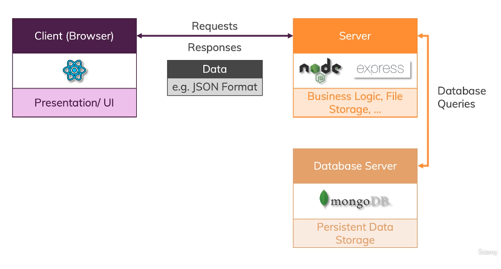

MERN is a common application stack used for building web applications. It utilizes MongoDB, Express.js, React.js, and Node.js.

The connection between the client and the server can take many forms, and which technique is most appropriate [depends on your use case](../../general/design-and-architecture/communicating-between-services.md/over-the-web.md), although since we're using React, GraphQL is likely a good candidate.