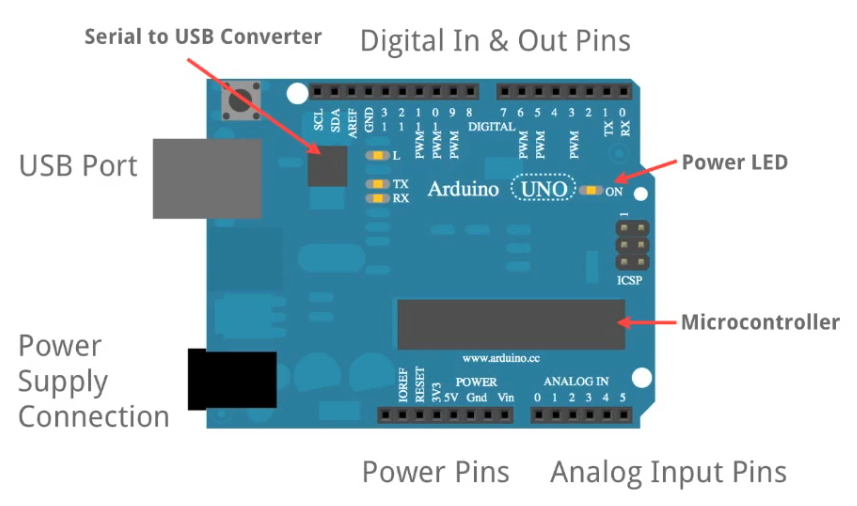

The Arduino board, and its variants, are used for prototyping your projects.

# Distilled

Arduino Distilled:

When powered, the processor of the Arduino and similar microcontrollers executes a single setup function and then runs another function in a loop. All of the code runs either in the setup function, or in the loop function.

The Arduino interacts with the world via pins to which wires and leads can be connected to make circuits. The pins are divided into three primary sections: the POWER section which outputs fixed voltages; the ANALOG IN section to which analog input devices like sensors can be connected; and the DIGITAL section, which is a bit more versatile than the other two sections. The pins in the DIGITAL section can be configured via the code loaded onto the microcontroller to either act as digital input or outputs, and the pins marked PWM (pulse width modulation) can even be configured as analog outputs. Also, the DIGITAL section contains TX->1 and RX<-0 pins which can be used to communicate with serial devices, such as Bluetooth and WiFi modules.

The code running on the microcontroller can read the voltage values of input pins and programmatically apply voltages to output pins in order to make use of sensor and actuators to serve real-world purposes. To do so, you will typically design one independent circuit per input and one independent circuit per output, all of them routing back through the Arduino's ground (~~technically, these circuits aren't actually independent and are just wired in parallel, I think, but I believe they can also be reasoned about and should function entirely independently~~).

You can use the static power pins to create basic static circuits, and then used _input pins_ to _measure_ various aspects of that circuit, and I think this is the general principle?

# Parts

This will vary slightly based on the implementation or variant of the board:

# About

[Programming the Arduino](./programming.md)

# Variants

[inventr HERO board](./inventr-hero-board.md)
