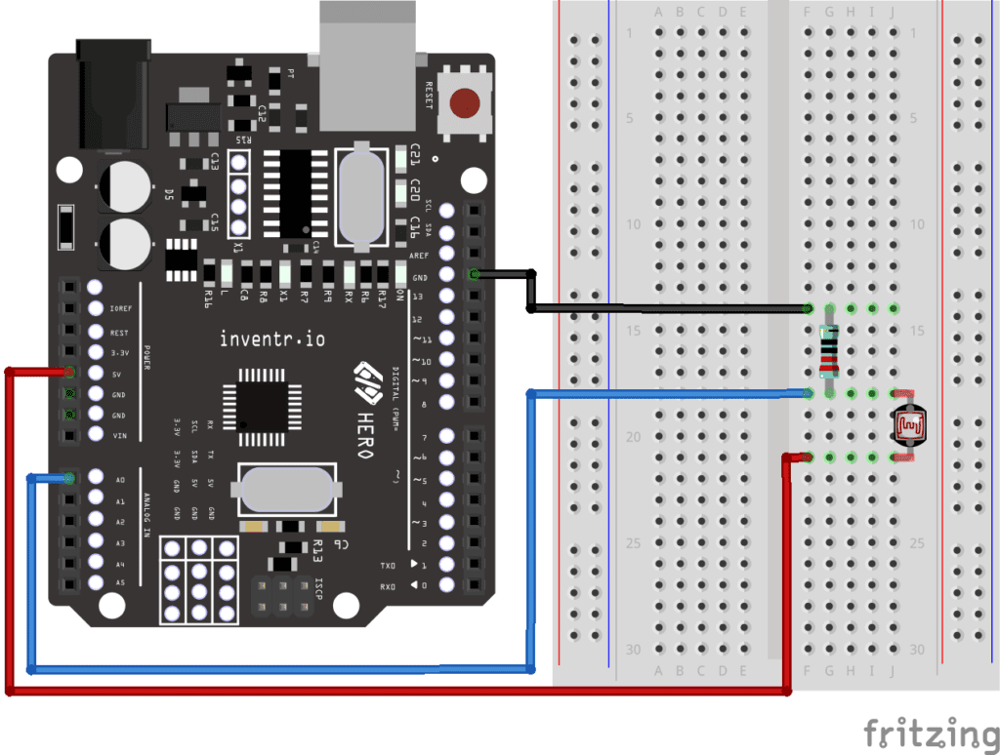

The resistance of a photoresistor is very high in the dark. When exposed to light, the resistance of the photoresistor decreases proportional to the light intensity.

Because of the property of components in series that they are voltage sharing, meaning that the voltage drop across each component in series must sum to the total voltage drop across both, we can use a photoresistor to measure light intensity via an analog input pin by creating a circuit with a basic resistor in series with our photoresistor. By measuring the voltage drop across the static resistor only, we will get larger voltages for larger light levels.

The first step is to create a basic circuit starting from the static 5V output of the Arduino's power pin., through a photoresistor, then through a basic static resistor, and finally through ground. This is self-contained circuit.

In addition to using the Arduino to create the circuit itself, we then use the Arduino to also _measure one aspect of this circuit_, by connecting from the Arduino A0 pin to the static resistor, and then straight from there to ground. With this configuration, a simple read from the A0 pin will tell us the voltage drop across the resistor.

Example:

