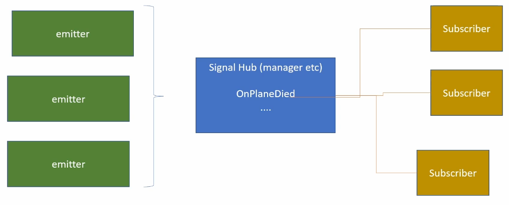

# Project Reference

See [Dodge The Creeps](https://github.com/RockLikeAmadeus/dodge-the-creeps).

# Key Concepts

A Godot game is a _tree_ of _nodes_ that you organize together into _scenes_. Nodes can communicate between each other using _signals_.

## Scenes

Godot **Scenes** serve a flexible dual purpose, acting as the Scene equivalent in an engine like Unity, while simultaneously behaving similarly to Unity's prefabs. Godot scenes are nestable, and are always composed of one or more _nodes_.

"A Godot scene could be a Weapon, a Character, an Item, a Door, a Level, part of a level… anything you'd like. It works like a class in pure code, except you're free to design it by using the editor, using only the code, or mixing and matching the two. It's different from prefabs you find in several 3D engines, as you can then inherit from and extend those scenes. "

"On top of acting like nodes, scenes have the following characteristics:

1. They always have one root node, like the "Player" in our example.
2. You can save them to your local drive and load them later.
3. You can create as many instances of a scene as you'd like. You could have five or ten characters in your game, created from your Character scene."

## Nodes

**Nodes** are your games smallest building blocks that you arrange into trees. A tree of nodes can be saved as a _scene_, much like Unity allows you to define a game object composed of components that can be saved as prefabs. Nodes serve the purpose of both Game Objects _and_ Components from Unity.

"Nodes are part of a tree and always inherit from their parents up to the Node class. Although the engine does feature some nodes like collision shapes that a parent physics body will use, most nodes work independently from one another. In other words, Godot's nodes do not work like components in some other game engines."

"All nodes have the following characteristics:

- A name.
- Editable properties.
- They receive callbacks to update every frame.
- You can extend them with new properties and functions.
- You can add them to another node as a child.
"

## The Scene Tree

Come back to this.

## Signals

Nodes emit **Signals** when certain events occur. They are Godot's version of the [_Observer_](https://gameprogrammingpatterns.com/observer.html) pattern.

There are a ton of built-in signals, and you can create custom ones as well. To see the list of built-in signals that your node can emit, select the node or scene and select the Node tab on the right, make sure Signals is selected. This will list the Signals for each child node of the scene.

### Subscribe to a built-in signal

To subscribe to a built-in signal, ~~select it in the Signals list with the node selected on the righthand side, and either double click or right-click and select "Connect". For C#, change the name of the Receiver Method to use Pascal case, click "Connect"~~, do so in pure code until Godot has removed the "C# Callback code won't be generated, please add it manually" warning, indicating that they've updated the engine to allow connecting through the IDE. For now, do it entirely in Code:

```cs
// Called when the node enters the scene tree for the first time.
public override void _Ready()
{
    AreaEntered += OnAreaEntered; // This is the part we would do in the IDE
}

private void OnAreaEntered(Area2D area) {
    GD.Print("Scored!");
}
```

### Create a custom signal

The name of the custom signal in this example is "OnScored". On the class that emits the signal:

```cs
[Signal] public delegate void OnScoredEventHandler();
```

Adding this line will generate a signal in the list in the Godot IDE (after rebuilding). Emit the signal with

```cs
EmitSignal(SignalName.OnScored);
```

~~Then in the class that will subscribe to the signal, add a new function with a signature that matches your delegate:~~

```cs
~~// TODO - subscribe to the event
~~private void OnScoredEventHandler()
```

In the class that will subscribe to the signal, establish some form of reference to the node or scene emitting the signal...

```cs
[Export] private Plane _plane; // requires a drag and drop in IDE
```

...and then subscribe in the ready function

```cs
public override void _Ready()
{
    _plane.OnPlaneDied += GameOver;
}
```

### Signal Bus pattern

In most cases, you should utilize the event bus pattern to emit and subscribe to signals rather than directly connecting up two distinct Nodes. The signal bus is an [Autoload](./how-to/README.md#share-variables-constants-shared-logic-etc-between-scenes) on which we declare all of our signals, and then all subscribers can easily listen to it.



When we use this method, we need to make sure we are explicitly unsubscribing to events when the Node that subscribes to them is cleaned up.

Game:
```cs
public partial class Game : Node2D
{
	public override void _Ready()
	{
		SignalBus.Instance.OnPlaneDied += GameOver;
	}

    public override void _ExitTree()
    {
		SignalBus.Instance.OnPlaneDied -= GameOver;
    }
```

SignalBus:
```cs
```

# Creating a "Game Object Prefab" (Scene)

The first step is to decide on a root node for the scene. "As a general rule, a scene's root node should reflect the object's desired functionality - what the object is." `Area2D` is a useful one, but it expects a collider, so isn't the right choice for elements that won't require collision logic.

Once you've decided on a root node type and selected it (after clicking "Other Node" in the Scene dock), you can double click the name of the root node to rename the root node to be the name of the Scene you're creating (i.e. change `Area2D` to `Player`).

Now that you've set the scene's root node, you can add child nodes to give it more functionality.

A useful sequence for creating a basic game object is to create an `Area2D` root node, then add a `Sprite2D` child (or `AnimatedSprite2D`), as well as a collider (`CollisionShape2D`). If the object needs custom logic, right click the node and select `Attach Script`.

# Get Started

[How-To](./how-to/)

# Tips

- Don't make one big scene do everything. Objects can delete themselves when it's time to delete them, for instance.
- Don't use abstract numbers for things that should be represented as physical locations in the game (create a Marker2D node).

# Groups

Nodes and scenes can be in local (to the scene) or global "groups", which let you tag them and distinguish them more easily.