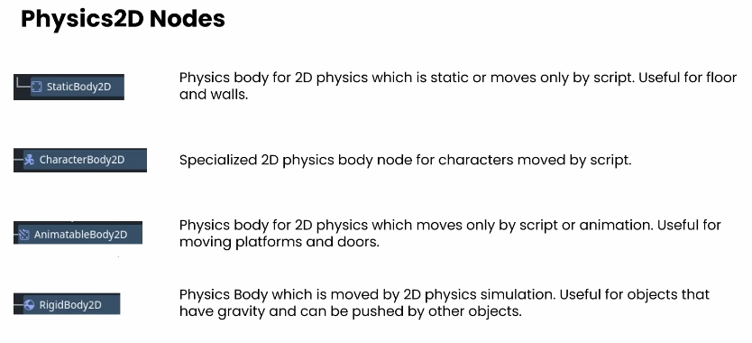

# CharacterBody2D node

Orange is where the physics engine takes over

Nodes that deal with physics typically name themselves with the word "Body" rather than the "Area" used in a lot of non-physics nodes (i.e., physics collisions use `BodyEntered` signal as opposed to non-physics `AreaEntered`).