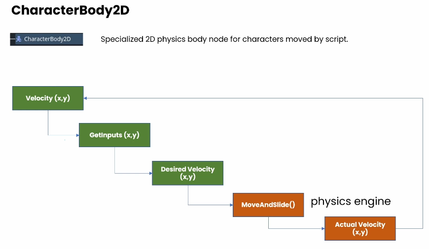

Nodes that deal with physics typically name themselves with the word "Body" rather than the "Area" used in a lot of non-physics nodes (i.e., physics collisions use `BodyEntered` signal as opposed to non-physics `AreaEntered`).

There are four main nodes:

### CharacterBody2D node

Orange is where the physics engine takes over

For CharacterBody2D nodes, we don't ever specify positions; instead, we specify desired velocities, and we let the physics engine figure things out from there.

### RigidBody2D node

Unlike CharacterBody2D nodes where we specify velocities, on RigidBody2D nodes we specify _forces_ (like gravity) or _impulses_ (like hitting a ball with a bat).

