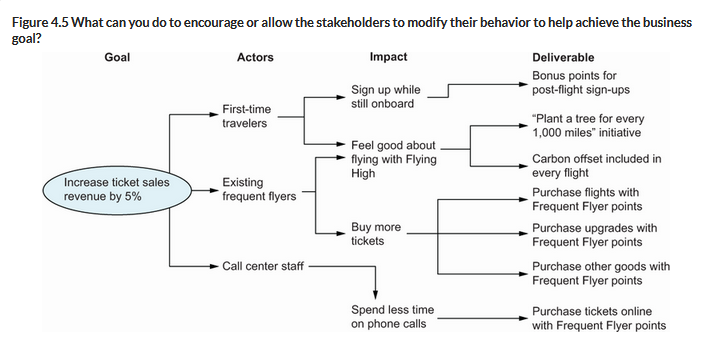
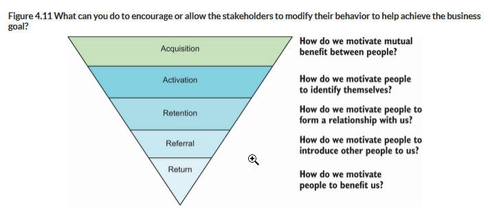
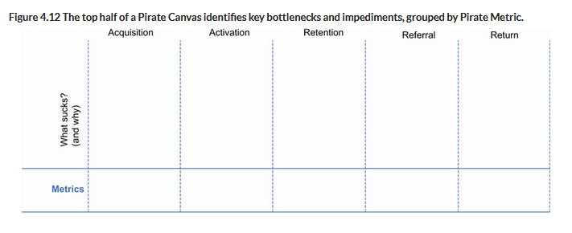
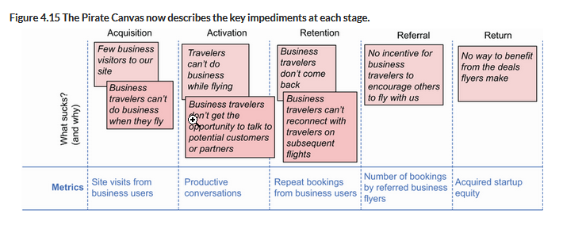
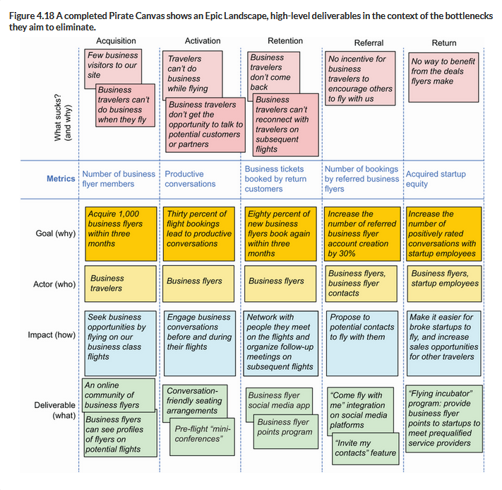

# Start with business goals

Before thinking about individual features of your software, you must get clear about what problems you're trying to solve and what business value you're trying to deliver. If the features we decide to build aren't derived from that, there's a great chance we're wasting our time by building the wrong thing.

The reason this phase is called "speculate" is to remind us that the value of the features we plan on developing is not guaranteed in advance. Instead, it's more like a hypothesis or bet that the feature will deliver the business value we intend for it. Developing features one at a time and then validating their value also gives us a chance to learn and better understand the problem domain. Later, in the validate phase, we'll examine the metrics that are produced from our experiment and feed them into the next speculate phase.

We begin with Strategic Planning, where we transform business opportunities or challenges into a prioritized list of features.

## Strategic Planning

In a conventional team structure, the strategic planning work involves all stakeholders, from high-level strategic decision makers to the individual contributors who will implement the features. This planning happens continuously throughout the project, rather than all at once at the beginning of the project (think agile approach rather than waterfall).

## Describing vision and goals for the business

This part involves the top two sections of [this pyramid](../_index.md#from-vision-to-executable-specification).

### Vision

It's best to start with a _vision statement_.  A good vision statement will be simple, clear, and concise, and will focus on the project's objectives, _not_ on how it will deliver those objectives. A useful template follows:

```
FOR <target customer>
WHO <needs something>
THE <product name> is a <product category>
THAT <key benefit, compelling reason to buy>
UNLIKE <primary competitive alternative>
OUR PRODUCT <statement of primary differentiation>
```

For example:

```
FOR travelers
WHO want to be rewarded for traveling with Flying High Airlines
THE Flying High Frequent Flyer program IS A loyalty program
THAT lets members easily and conveniently view and manage their accumulated 
 points in real time, and spend their points for real purchases with 
 unequaled ease.
UNLIKE other airline Frequent Flyer programs,
OUR PRODUCT lets members use their points easily for any sort of online or 
 brick-and-mortar purchase.
```

### Business Goals

A good business goal might be simply "increase ticket sales by 5%", or could be more formal, as in:

```
In order to increase ticket sales by 5% over the next year
As the Flying High Sales Manager
I want to encourage travelers to fly with Flying High rather than with a rival company
```

Keep in mind the S.M.A.R.T goal framework when deciding on business goals. 

Almost all business goals can be boiled down to one or more of these four

- Increasing revenue
- Reducing costs
- Protecting revenue
- Avoiding future costs 

For example, a complete list of goals for a frequent flyer program might include

- Increase ticket sales revenue by 5% over the next year by encouraging travelers to fly with Flying High rather than with a rival company.
- Increase the customer base by 10% within a year by building a positive image of the Frequent Flyer program.
- Avoid losing existing customers to the new rival Hot Shots Frequent Flyer program.
- Reduce hotline costs by enabling Frequent Flyer members to purchase flights with their points directly online, unlike the current program, where travelers need to call to make a booking.

When you're presented with a requirement or a set of requirements, "pop the why stack" by asking _why_ questions until you get to the ultimate motivation for the requirement.

# Tease out features from the business goals


## Impact Mapping

Creating impact maps is a visual and intuitive approach to building up an initial picture of what you're trying to achieve with your project. They help visualize the relationship between the business goals, the relevant actors, and the expected features, and deliver other benefits as well. They center around five related questions:

1. Pain point - What business problem are we solving and how can we measure it?
2. Goal - What are we going to do about it? What are we aiming to improve, and by how much?
3. Actors - Who are the key people involved? This often goes beyond just _users_ of your system. It's important to note that even if the overall benefit is a net positive, the overall impact for some individual actors might be negative, though we should try to minimize that negative impact.
4. Impact - How can we help these actors to help us achieve our goals? What changes in behavior are we driving?
5. Deliverables - What application features might support these behavior changes?

Step 2, the Goal step, is where we outline the first, left-most nodes in our impact map. The remaining nodes branch out from this node, based on the subsequent steps.



### Reverse Impact Mapping

This process can be done in reverse in the common case in which you're given a set of requirements or a list of features from the powers that be. Impact mapping in reverse can help you to get clear about the business goals at the root of the features or requirements you've been handed.

## Pirate Canvases

Pirate canvases are another approach to thinking about the features of your product, one which can help explore the broader ecosystem of products and services in addition to the project at hand. The first concept to be aware of regarding pirate canvases are _pirate metrics_.

### Pirate metrics

Investor Dave McClure identified five key metrics that businesses, especially startups, need to focus on in order to be successful: Acquisition, Activation, Retention, Referral, and Return.



_Acquisition_ is about how we pull actors into our ecosystem of products/services. This often involves offering to solve at least part of their problems for free. Remember that users are not the only actors in our system. Essentially, acquisition is about making potential users _aware_ of our solution.

_Activation_ is actually getting users to engage, by signing up for a trial, registering their email address, or even purchasing or signing up for our service.

_Retention_ is getting activated customers to stay, or to come back.

_Referral_ is about growth via personal recommendations, positive reviews, etc.

_Return_ is a measure of how much each user contributes to our organizations goals, in return for the problem we're solving.

Each of these metrics should correspond to concrete, measurable numbers. What those numbers are will vary for each metric, and for each domain. For example:

- Acquisition could be measured by counting the number of visitors to our Frequent Flyer website.
- Activation might correspond to the number of users who sign up for the Frequent Flyer card.
- Retention might measure the number of users who sign up to the Frequent Flyer program and come back to check out the latest special deals.
- Referral could keep track of the number of likes or shares on social media, or the number of positive reviews on travel websites.
- Return could be measured by things like ticket sales from Frequent Flyer members, or maybe the impact in the overall ticket sales.

It's important to keep track of these metrics to measure your progress towards achieving business goals and to be aware of bottlenecks so that you know what your next most important problem to tackle is.

Pirate metrics are a useful tool for analyzing existing products, but they can also help identify new features or new products altogether.

### From pirate metrics to pirate canvases

Developing a pirate canvas starts by asking a general question, like "what sucks about ____?", which is a good starting point for thinking about what unique solutions you can provide. Rather than thinking about individual features or even specific applications, we start thinking about the answer to this question by using the five pirate metrics. Discuss or think about each metric in turn, identifying the aspects of each area that can be improved, then using the "five whys" to get to the root cause of that problem. A template for the header of a pirate canvas looks something like this



The first step is to fill this in with the pain points relevant to each metric, and get clear about how we might measure improvements to this metric, while drilling down into recursive "whys" to get to the root cause. For example:



### Building the Epic Landscape.

From this point, we can start to identify possible solutions to these problems that we could consider implementing. We translate the pain points and metrics into measurable goals, and then starting with these goals, follow a similar approach to that of impact mapping to identify actors, impacts, and deliverables. These deliverables become the _epics_ in the Epic Landscape.

Ultimately, you might arrive at a canvas that looks something like this:


Notice that these deliverables don't necessarily involve software, because pirate canvases encourage us to look beyond only software solutions, instead considering the broader ecosystem as a whole (though software solutions are just as valid).

From this exercise, you can see that a number of possible deliverables begin to become clear. Of course, we aren't limited to one actor/impact/deliverable per metric.

