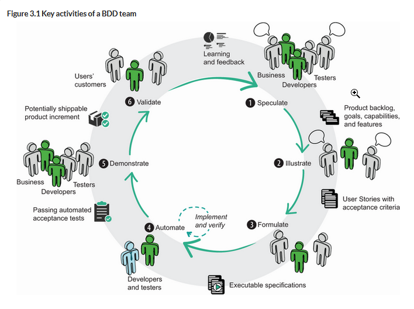

[Source](https://livebook.manning.com/book/bdd-in-action-second-edition/chapter-3/)

# High-Level End-to-End BDD Example

The process essentially has a 6-step cycle:

1. [Speculate](#speculate-identifying-business-values-and-features): Identify high-level business goals and key features for achieving them
2. [Illustrate](): Get concrete about a specific feature using examples
3. [Formulate](): Transform examples into executable specifications
4. [Automate](): Transform executable specifications into automated acceptance tests
5. [Demonstrate](): Show that the feature does what it is supposed to do
6. [Validate](): Observe how the feature behaves in the real world

This example describes the process of building an application for a public transport department which provides train timetable data and rel-time updates about delays, track work, etc.

## Speculate: Identifying business values and features

### 1. Identify business objectives

Identify the business problem we're solving. 