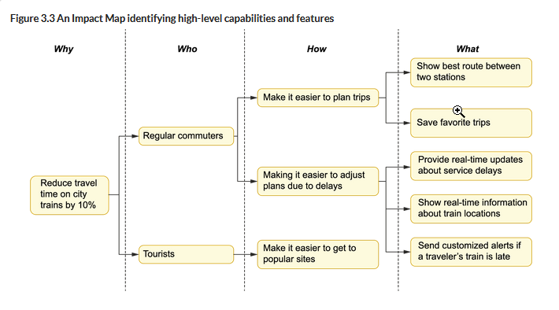
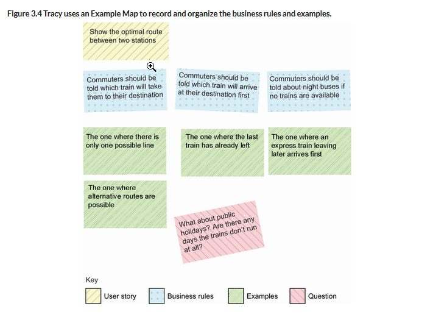
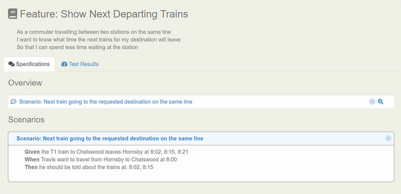
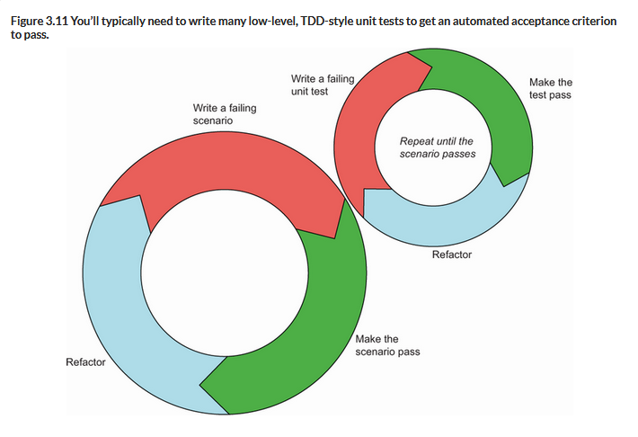
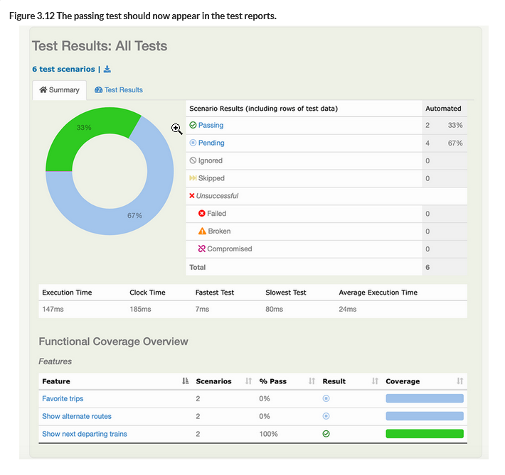

[Source: BDD in Action, Chapter 3](https://livebook.manning.com/book/bdd-in-action-second-edition/chapter-3/)

# High-Level End-to-End BDD Example

This example describes the process of building an application for a public transport department which provides train timetable data and rel-time updates about delays, track work, etc.

It's broken down based on the steps specified [here](./_index.md#high-level-process).

## 1. Speculate: Identifying business values and features

### 1. Identify business objectives

Identify the business problem we're solving. In this case, at a high level, we want to build an application that makes it easier for commuters to plan their commutes. But we want to get more specific than that, so we'll state the project vision as such:

"The application will help to reduce average travel time for regular commuters by 10% within a year, by allowing them to plan their journeys more effectively.”

### 2. Discover capabilities and features

Now, we focus on ideation for features that will directly support our stated business objectives. The technique of Impact Mapping can be a useful exercise to discover and prioritize high-level capabilities and features through the lens of four questions: why, who, how, and what.
1. Why (are we doing this)?
2. Who (is this for, are the key actors)?
3. How (might their behavior change with our solution)?
4. What (features might support this behavior change)?



### 3. Describe each feature

The following format is common and helps ensure that each feature actively contributes to a business goal. It is especially appropriate for higher-level features:

```
In order to <achieve a business goal or deliver business value>
As a <stakeholder>
I want <to be able to do something>
```

For example:

```
In order to plan my trips more effectively
As a commuter
I want to know the optimal itinerary between two stations
```

Another valid format, perhaps more appropriate for the detailed user stories within a feature:


```
As a <stakeholder>
I want <something>
So that <I can achieve some business goal>
```

For example:

```
As a commuter
I want to know the best way to travel between two stations
So that I can get to my destination quickly
```

Or even:

```
As a commuter
I want to be able to easily find the optimal route between two stations
So that I can get to my destination quickly
Whereas currently I need to look up the timetable in a paper booklet
```

## 2. Illustrate: Exploring features with examples

Thinking only about abstractions can lead to flawed assumptions and other problems. Here, we want to talk through concrete examples, using a technique such as [Example Mapping](internal-link-here).



### Slice the feature into user stories

_Direct Connections_

As a commuter traveling between two stations on the same line

I want to know what time the next trains for my destination will leave

So that I can spend less time waiting at the station

_Alternative Routes_

As a commuter traveling between two stations on different lines

I want to know what time the fastest train to my destination will leave

So that I can spend less time waiting at the station or for connecting trains

## 3. Formulate: From examples to executable specifications

In BDD, the following notation is often used to express examples:

```
Given <a context>
When <something happens>
Then <you expect some outcome>
```

When expressed this way, these are called _scenarios_, and they are intentionally a bit less flexible in order to use these as the basis for automated tests later on. With concrete scenarios defined in this way, you'll be able to more easily notice logical errors, missing context, or situations that are more complex than first thought:

```
Scenario: Display the next train going to the requested destination
  Given the T1 train to Chatswood leaves Hornsby at 8:02, 8:15, 8:21
  When Travis wants to travel from Hornsby to Chatswood at 8:00        
  Then he should be told about the trains at: 8:02, 8:15
```

## 4. Automate: From executable specifications to automated tests

Depending on your tech stack, there are many specialized BDD tools that you can use to automate your acceptance criteria, such as Cucumber, SpecFlow, and Behave. These aren't absolutely necessary, but can make it easier to express automated tests in a structured form (given, when, then).

There are also tools for other aspects of this process, such as the open source [Serenity BDD](https://serenity-bdd.info/), and [Selenium](https://www.selenium.dev/).

### Cucumber feature files

We can define the feature file based on the feature we described in the last section like this:

`show_next_departing_trains.feature`:
```
Feature: Show next departing trains
 
  As a commuter traveling between two stations on the same line
  I want to know what time the next trains for my destination will leave
  So that I can spend less time waiting at the station
  Scenario: Next train going to the requested destination on the same line
    Given the T1 train to Chatswood leaves Hornsby at 8:02, 8:15, 8:21
    When Travis wants to travel from Hornsby to Chatswood at 8:00
    Then he should be told about the trains at: 8:02, 8:15
```

Running this executable specification without any underlying test code will produce an error, but if we're using Serenity BDD (I think), it will also generate a set of reports:



### Automating the executable specifications

First, we make sure that our test runner is configured to run all of the feature files (likely under the features directory somewhere). In Java, that would look like this:

```java
@RunWith(CucumberWithSerenity.class)
@CucumberOptions(features="src/test/resources/features/",   
                 glue="manning.bddinaction"
)
public class AcceptanceTestSuite {}
```

but if you aren't using Java and Serenity, you can probably set this up more manually.

Now we can write test automation code to be called whenever our scenario is executed. We write a method for each of the `Given`, `When`, and `Then` steps. Cucumber uses special annotations (`@Given`, `@When`, and `@Then` in Java) to know which methods to run for each step of the scenario. Additionally, we use a special notation called Cucumber Expressions to identify the parts of the scenario that represent the actual test data (variables), which we often call _glue code_ since it binds the text in the scenario steps to the actual test automation code.

In Java, we might make a `stepdefinitions` package which defines the following class with empty methods:

```java
package com.bddinaction.traintimetables.stepdefinitions;
 
import io.cucumber.java.ParameterType;
import io.cucumber.java.en.Given;
import io.cucumber.java.en.Then;
import io.cucumber.java.en.When;
 
public class DepartingTrainsStepDefinitions {
 
    @Given("the {} train to {} leaves {} at {}")    
    public void theTrainLeavesAt(String line,
                                 String to,
                                 String from,
                                 String departureTimes) {}
 
    @When("Travis want to travel from {} to {} at {}")
    public void travel(String from, String to, String departureTime) {}
 
    @Then("he should be told about the trains at: {}")
    public void shouldBeToldAboutTheTrainsAt(String expectedTimes) {}
}
```

Code like this tells you precisely what your underlying code needs to do to satisfy the business requirements.

### Implementing the glue code

From this point, we can start to think about not just what our production code should do, but also how best to test it. Because the BDD approach lends itself to starting with the desired outcome and working backwards, beginning with the `then` step is reasonable. For this example, we imagine a service to implement the timetable logic; we don't know quite what it will look like yet, but we know that it needs to give us a list of proposed departure times.

#### Defining the expectations in the `Then` method

Writing the glue code is the perfect opportunity to experiment with different API designs and see what feels the most appropriate. We update the method annotated with `@Then` to describe the expected outcome:

```java
@Then("he should be told about the trains at: {times}")
  public void shouldBeToldAboutTheTrainsAt(List<LocalTime> expected) {
    assertThat(proposedDepartures).isEqualTo(expected);
  }
 
 // represents time as an instance of java.time.LocalTime
  @ParameterType(".*")
  public LocalTime time(String timeValue) {
    return LocalTime.parse(timeValue, DateTimeFormatter.ofPattern("H:mm"));
  }
 
  @ParameterType(".*")
  public List<LocalTime> times(String timeValue) {
    return stream(timeValue.split(","))
            .map(String::trim)
            .map(this::time)
            .collect(Collectors.toList());
  }
```

#### Discovering the service class API in the `When` method

Of course, `proposedDepartures` isn't defined yet, so we begin to define the `@When` case:

```java
List<LocalTime> proposedDepartures;
 
  @When("Travis want to travel from {} to {} at {time}")
  public void travel(String from, String to, LocalTime departureTime) {
    proposedDepartures = itineraryService.findNextDepartures(departureTime,
                                                             from, to);
  }
 
 // I don't know why this is defined again, maybe an error?
  @ParameterType(".*")
  public LocalTime time(String timeValue) {
    return LocalTime.parse(timeValue);
  }
```

At the top of the class, we construct a simple `itineraryService`...

```java
ItineraryService itineraryService = new ItineraryService();
```

...and wherever our production code lives, we define the class itself with the minimum necessary structure to get the project to compile:

```java
public class ItineraryService {
      public List<LocalTime> findNextDepartures(LocalTime departureTime, String from, String to) {
        return null;
    }
  }
```

We may note that, in order to function as intended, the `ItineraryService` will eventually need to know about the timetable details mentioned in the `Given` step. This will likely turn into its own `TimetableService` class, but to avoid getting sidetracked, we just create a simple `TimeTable` interface to model how the `ItineraryService` will interact with the service we will flesh out later. This is an _outside-in_ approach, typical in BDD: as we implement a layer, we discover functions or other dependencies that this layer will rely on. For simpler problems, we can build those dependencies on the spot. For more complex code, its best to model them as an interface or a dummy implementation and come back to it later as other scenarios drive their need.

#### Going from acceptance tests to unit tests

While acceptance tests often use a full (or near-full) application stack, unit tests concentrate on individual components in isolation to build up the components that implement the desired behavior. Test-driven development using unit tests makes it easier to focus on getting a particular unit of the code working, and identifying what other services or components it will depend on to do its job. Additionally, having unit tests in place makes it easier to isolate errors in the future. Typically, we write many small unit tests to get a larger acceptance test to pass.



In our example, we start implementing the `findNextDepartures()` method of the `ItineraryService` using a TDD approach. We define a failing test, iteratively, as we discover just how the unit-under-test (in this case, the itineraryService) should work:

```java
package manning.bddinaction.itineraries;
 
import org.junit.jupiter.api.DisplayName;
import org.junit.jupiter.api.Test;
import java.time.LocalTime;
import java.util.List;
 
import static org.assertj.core.api.Assertions.assertThat;
 
@DisplayName("When finding the next train departure times")
class WhenFindingNextDepatureTimes {
 
    @Test
    @DisplayName("we should get the first train after the requested time")
    void tripWithOneScheduledTime() {
  
        // Given
        timeTable = departures(at("8:10"), at("8:20"), at("8:30"));
        ItineraryService itineraryService = new ItineraryService(timeTable);
 
        // When
        List<LocalTime> proposedDepartures
            = itineraryService.findNextDepartures(at("8:25"),
                                                  "Hornsby",
                                                  "Central");
 
        // Then
        assertThat(proposedDepartures)
            .containsExactly(at("8:30"));
    }

    // Utility method
    private LocalTime at(String time) {
      return LocalTime.parse(time, DateTimeFormatter.ofPattern("H:mm"));
    }
 
    // Will return a TimeTable, once we know how TimeTable works...
    private TimeTable departures(LocalTime... departures) {
      return null; 
    }    
}
```

At this point, we could guess at what methods the `TimeTable` class needs, but it may be easier to simply begin implementing the `findNextDepartures()` method and see what information we'll need a `TimeTable` to provide.

After some experimenting, we decide that the main job of the `findNextDepartures()` method is to find out which lines go between the two stations (which the TimeTable should know), and then to find the next two trains to arrived after the specified time:

```java
package manning.bddinaction.itineraries;
 
import manning.bddinaction.timetables.TimeTable;
 
import java.time.LocalTime;
import java.util.List;
import java.util.stream.Collectors;
 
public class ItineraryService {
    private TimeTable timeTable;
 
    public ItineraryService(TimeTable timeTable) {
        this.timeTable = timeTable;
    }
 
    public List<LocalTime> findNextDepartures(LocalTime departureTime, String from, String to) {
 
      var lines = timeTable.findLinesThrough(from, to);

      return lines.stream()
              .flatMap(line -> timeTable.getDepartures(line).stream())
              .filter(trainTime -> !trainTime.isBefore(departureTime))
              .sorted()
              .limit(2)
              .collect(Collectors.toList());
    }
}
```

At this point, rather than branching out onto a tangent and building out the TimeTable class, we simply implement a dummy TimeTable that returns a hard-coded list of times. By attempting to build out the `ItineraryService`, we've discovered two things we need from the `TimeTable` class: it needs to know which train lines go through any two stations, and it needs to know what time trains leave a given station on each line. This is the outside-in approach, which we use to define the initial expected interface for a `TimeTable`:

```java
public interface TimeTable {
  List<String> findLinesThrough(String from, String to);
  List<LocalTime> getDepartures(String lineName, String from);
}
```

Now we can return to the original test and implement the dummy `TimeTable` that our `ItineraryService` test will use:

```java
private TimeTable departures(LocalTime... departures) {
  return new TimeTable() {
    @Override
    public List<String> findLinesThrough(String from,
                                          String to) {
      return List.of("T1");
    }

    @Override
    public List<LocalTime> getDepartures(String line, String from) {
      return List.of(departures);
    }
  };
}
```

With this, the first test should pass.

##### Adding a few more unit tests

We continue to explore the behavior and use the TDD process to add a few more tests to illustrate the different facets of this behavior, such as different scenarios, or edge cases.

```java
package manning.bddinaction.itineraries;
 
import manning.bddinaction.timetables.TimeTable;
import org.junit.jupiter.api.DisplayName;
import org.junit.jupiter.api.Test;
import java.time.LocalTime;
import java.time.format.DateTimeFormatter;
import java.util.List;
import static org.assertj.core.api.Assertions.assertThat;
 
@DisplayName("When finding the next departure times")
class WhenFindingNextDepatureTimes {
 
  private LocalTime at(String time) {
      return LocalTime.parse(time, DateTimeFormatter.ofPattern("H:mm"));
  }

  private static TimeTable departures(LocalTime... departures) {
      return new TimeTable() {

          @Override
          public List<String> findLinesThrough(String departingFrom,  
                                                String goingTo) {
              return List.of("T1");
          }

          @Override
          public List<LocalTime> getDepartures(String line,
                                                String from) {
              return List.of(departures);
          }
      };
  }

  TimeTable timeTable;
  ItineraryService itineraries;

  @Test
  @DisplayName("should the first after the departure time")
  void tripWithOneScheduledTime() {

      timeTable = departures(at("8:10"), at("8:20"), at("8:30"));
      itineraries = new ItineraryService(timeTable);

      List<LocalTime> proposedDepartures
          = itineraries.findNextDepartures(at("8:25"),
                                            "Hornsby","Central");

      assertThat(proposedDepartures).containsExactly(at("8:30"));

  }

  @Test
  @DisplayName("should propose the next 2 trains")    
  void tripWithSeveralScheduledTimes() {

      timeTable 
        = departures(at("8:10"), at("8:20"), at("8:30"), at("8:45"));
      itineraries = new ItineraryService(timeTable);
      List<LocalTime> proposedDepartures
        = itineraries.findNextDepartures(at("8:05"),"Hornsby","Central");

      assertThat(proposedDepartures)
        .containsExactly(at("8:10"), at("8:20"));
  }

  @Test
  @DisplayName("No trains should be returned if none are available").
  void anAfterHoursTrip() {

      timeTable = departures(at("8:10"), at("8:20"), at("8:30"));
      itineraries = new ItineraryService(timeTable);

      List<LocalTime> proposedDepartures
              = itineraries.findNextDepartures(at("8:50"),
              "Hornsby", "Central");

      assertThat(proposedDepartures).isEmpty();
  }
}
```

With this, the initial version of the itinerary service is complete, making the `when` step of our scenario fully operational.

#### Automating the preconditions in the @Given method

Finally, we move to automating the `Given` step: "Given the T1 train to Central leaves Hornsby at 8:02, 8:15, 8:21".

This step will prepare the `TimeTable` that the production itinerary service will use. Unlike earlier where we used a dummy time table to get a _unit_ test to pass, we're back at the level of _acceptance_ tests, so we want to verify that all the system components work together as they should. Going back to the glue code, above, we fill out the implementation for the `@Given` method:

```java
InMemoryTimeTable timeTable = new InMemoryTimeTable();
ItineraryService itineraryService = new ItineraryService(timeTable);

@Given("the {} train to {}  leaves {}  at {times}")
public void theTrainLeavesAt(String line,
                            String from,
                            String to,
                        List<LocalTime> departureTimes) {
  List<LocalTime> departureTimes = localTimesFrom(departingAt);
  timeTable.scheduleService(line, departureTimes, from, to);
}
```

The `scheduleService` method should be implemented by our time table class in order to register a set of departure times between stations on a given line. This is something of a specific concern, so for now, we don't include it as part of the `TimeTable` interface:

```java
public interface CanScheduleServices{
  void scheduleService(String line,
                      List<LocalTime> departingAt,
                      String departure,
                      String destination);
}
```

##### Implementing the service (using unit tests)

Now we just need a time table class that implements both the `TimeTable`  as well as the `CanScheduleService` interfaces. Again, we use a TDD approach that starts with a failing unit test.

```java
@DisplayName("When scheduling train services")
class WhenRecordingTrainSchedules {
 
  // Given
  InMemoryTimeTable timeTable = new InMemoryTimeTable();

  @Test
  @DisplayName("We can schedule a trip with a single scheduled time")
  void tripWithOneScheduledTime() {
    // When
    timeTable.scheduleService("T1", LocalTimes.at("09:15"),
                              "Hornsby",
                              "Central");
    // Then
    assertThat(timeTable.getDepartures("T1", "Hornsby")).
        .hasSize(1);
  }
}
```

then we define a skeleton implementation, to get the test to build:

```java
public class InMemoryTimeTable implements TimeTable, CanScheduleServices {
 
  @Override
  public void scheduleService(String line,
                              List<LocalTime> departingAt,
                              String departure,
                              String destination) {}

  @Override
  public List<String> findLinesThrough(String from, String to) {
      return null;
  }

  @Override
  public List<LocalTime> getDepartures(String lineName, String from) {
      return null;
  }
}
```

We start implementing the functionality, in order to get the test to pass...

```java
public class InMemoryTimeTable implements TimeTable, CanScheduleServices {
  private Map<String, ScheduledService> schedules = new HashMap<>();

  @Override
  public void scheduleService(String line,
                              List<LocalTime> departingAt,
                              String from,
                              String to) {
      schedules.put(line, 
                    new ScheduledService(from, to, departingAt));
  }
  ...
}
```

...which leads us to defining a domain class for a scheduled service...

```java
public class ScheduledService {
    private final String departure;
    private final String destination;
    private final List<LocalTime> departureTimes;
 
    public ScheduledService(String from, String to, List<LocalTime> at) {
        this.departure = from;
        this.destination = to;
        this.departureTimes = at;
    }
       ...
}
```

...which gets us a passing test. We can continue thinking through and implementing the timetable behavior using the red-green-refactor TDD process. Once they are satisfied, they can be confident that the "given" step is functional.

#### Getting to a passing acceptance test: implementing the TimeTable service

At this point, each of the "given", "when", and "then" steps work individually, but the test scenario in its entirety isn't passing. We need to implement the TimeTable service--specifically, the `findLinesThrough()` and `getDepartures()` methods. We start with a failing test...

```java
@Test
@DisplayName("When querying train services")
class WhenQueryingTrainServices {
  // Given
  InMemoryTimeTable timeTable = new InMemoryTimeTable();

  @Test
  @DisplayName("We can ask which lines go through any two stations")
  void queryLinesThroughStations() {
      // When
      timeTable.scheduleService("T1",
                                LocalTimes.at("09:15"),
                                "Hornsby", "Central");
      // Then
      assertThat(timeTable.findLinesThrough("Hornsby", 
                              "Central")).hasSize(1);
  }    
}
```

...and do the bare minimum to get to the test to build and pass...

```java
@Override
public List<String> findLinesThrough(String from, String to) {
  schedules.entrySet()
            .stream()
            .filter(line -> (line.getValue().getDeparture().equals(from)          
                    && line.getValue().getDestination().equals(to)))
            .map(Map.Entry::getKey)
            .collect(Collectors.toList());
}
```

...and finally, refactor for readability...

```java
private Set<String> lineNames() { return  schedules.keySet(); }
 
private boolean lineGoesThrough(String line, String from, String to){
  return schedules.getOrDefault(line, ScheduledService.NO_SERVICE)
                  .goesBetween(from,to);
}
  
@Override
public List<String> findLinesThrough(String from, String to) {
  return lineNames().stream()
                    .filter(line  -> lineGoesThrough(line, from, to))
                    .collect(Collectors.toList());
}
```

...which leads us to refactor `ScheduledService`...

```java
public class ScheduledService {
  private final String from;
  private final String to;
  private final List<LocalTime> departureTimes;
 
  public static ScheduledService NO_SERVICE
                   = new ScheduledService("","", Lists.emptyList());
 
  public ScheduledService(String from, String to, List<LocalTime> at) {...}
 
  public List<LocalTime> getDepartureTimes() {
    return departureTimes;
  }
 
  public boolean goesBetween(String from, String to) {
    return this.from.equals(from) && this.to.equals(to);
  }
}
```

Which completes one red-green-refactor cycle.

Then, we add a new test to demonstrate how to get the departure times of a given line:

```java
@Test
@DisplayName("Each line can have a number of departure times")
void trainLinesHaveMoreThanOneDepartureTime() {
  // When
  timeTable.scheduleService("T1",
              LocalTimes.at("09:15","09:45"),
              "Hornsby",
              "Central");
  // Then
  assertThat(timeTable.getDepartures ( "T1", "Hornsby")).hasSize(2);
  }
```

We continue on to get the test to pass, and then to refactor, and after a handful of small tests developed over a handful of TDD cycles, we ultimately wind up with an `InMemoryTimeTable` class that looks something like this:

```java
package manning.bddinaction.timetables;
 
import java.time.LocalTime;
import java.util.*;
import java.util.stream.Collectors;
 
public class InMemoryTimeTable implements TimeTable, CanScheduleServices {
  private Map<String, ScheduledService> schedules = new HashMap<>();
 
  @Override
  public void scheduleService(String line,
                                List<LocalTime> departingAt,
                                String from,
                                String to) {
      schedules.put(line, 
                    new ScheduledService(from, to, departingAt));     
  }
 
  private Set<String> lineNames() { return  schedules.keySet(); }
 
  private boolean lineGoesThrough(String line, String from, String to) {
    return schedules.getOrDefault(line, ScheduledService.NO_SERVICE)
                        .goesBetween(from,to);
  }
  @Override
  public List<String> findLinesThrough(String from, String to) {
    return lineNames().stream()
                      .filter(line  -> lineGoesThrough(line, from,to))
                      .collect(Collectors.toList());
  }
 
  @Override
  public List<LocalTime> getDepartures(String lineName, String from) {
    if (!schedules.containsKey(lineName)) {
      throw new UnknownLineException("No line found: " + lineName);
    }
    return schedules.get(lineName).getDepartureTimes();
  }
}
```

At last we have arrived at passing acceptance criteria, with a collection of small unit tests to test the components in isolation.

## Demonstrate: Tests as living documentation

Now that we have a passing acceptance test scenario built with the BDD process, we have much more than just a repeatable automated test. We also have a concrete measure of our progres, indicating just where we're at in the development progression:



More than that, we're also building a library of documented concrete examples of how the system is used to solve specific business requirements. For web tests, this can easily include screenshots to illustrate the process visually.