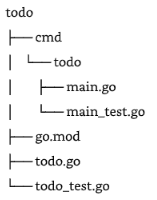

# Setting up the project

- Make a new folder for the utility (module)
- `cd` into the new directory
- Make a new folder called `cmd`. Do not `cd` into this.
- `$ go mod init github.com/RockLikeAmadeus/myproject`
- Create the rest of the project structure according to [Code Organization](#code-organization)

# Code organization

A common pattern for creating a CLI is to have a main package for the CLI executable, and a separate package for the business logic. This way you (or other developers) can re-use the behavior of the tool via another interface (even a different style of CLI). The business logic package sits at the module's root, and the `cmd` package is in a folder beside it. It looks like this:

