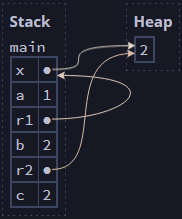

# Fixing Common Ownership-Related Problems

https://rust-book.cs.brown.edu/ch04-03-fixing-ownership-errors.html#safe-subset

# Real-World Problems

# Tips

- Whenever you create a variable in Rust, think about whether that value will change in the future, and whether it will be allocated on the stack or on the heap. This way, you can think ahead about the way that variable will be used while keeping ownership rules in mind.

https://rust-book.cs.brown.edu/ch06-04-inventory.html

# My own rules of ownership:

- Each value in rust has an owner, and can only have one at a time
- When the owner goes out of scope, the value will be dropped
- Once a value has been moved, the previous owner is invalidated.
- Moves of heap allocated values occur when:
  - You assign an existing value to another variable
  - You pass a value to a method or function (this includes calling methods with the first parameter of type `Self`)
  - You return a value from a function

Ownership allows us to treat heap values like stack values--the memory taken up by stack variables is automatically freed when the variable goes out of scope. This is harder with heap variables in most languages because multiple references can exist, so the moment when a variable goes out of scope is not sufficient to say that value isn't used anymore. Rust solves this by only allowing one variable to "own" that value, and then treats it like a stack variable.

# Cloning and Copying

Types annotated with the `Copy` trait is for types that are stored on the stack. If a type implements `Copy`, variables that use it don't perform a _move_, because the copy is trivial

Use `clone()` to deep copy, and ultimately avoid moves. The below example describes the same behavior as if these were primitive types using simple copying, but we want the explicit call because `clone()` could be expensive, so we want to call it out:

```rust
let s1 = String::from("hello");
let s2 = s1.clone(); // <-- Here, the copy is explicit.
println!("s1 = {}, s2 = {}", s1, s2);
```

# References and Borrowing

Of course, sometimes we want to assign a value or call a function but we don't want to _move_ the value into the new variable--we want to maintain the ownership. This is where _borrowing_ and _references_ come in.

A reference _is_ a type of pointer, but with an additional guarantee that _a reference always points to a valid value_. References are also _non-owning_ pointers.

```rs
fn main() {
    let s1 = String::from("hello");
    let len = calculate_length(&s1); // <-- Pass a reference to s1
    println!("The length of '{}' is {}.", s1, len);
}

// Accept a reference to a string
fn calculate_length(s: &String) -> usize {
    s.len()
    // s goes out of scope here, but doesn't own its value, so it's not dropped
}
```

### Mutable References

We can't modify something we're borrowing without a _mutable reference_. The major restriction with mutable references is that if you have a mutable reference to a value, no other references to that value can exist simultaneously.

### CRITICAL: The Scope of References

**A reference's scope is different than the scope of other types**, and this is really important, although confusing. A reference's scope starts from where it is introduced and continues through _the last time that reference is used._ For example:

```rust
let mut s = String::from("hello");

let r1 = &s; // no problem
let r2 = &s; // no problem
println!("{} and {}", r1, r2);
// variables r1 and r2 will not be used after this point

let r3 = &mut s; // no problem
println!("{}", r3);
```

Understanding this behavior is critical; not understanding it is guaranteed to lead to confusion!

# Pointers and De-referencing Syntax

This syntax isn't necessary in most cases because Rust performs these operations implicitly in most real-world code, but it's good to be aware of.

```rust
let mut x: Box<i32> = Box::new(1);
let a: i32 = *x;         // *x reads the heap value, so a = 1
*x += 1;                 // *x on the left-side modifies the heap value,
                         //     so x points to the value 2

let r1: &Box<i32> = &x;  // r1 points to x on the stack
let b: i32 = **r1;       // two dereferences get us to the heap value

let r2: &i32 = &*x;      // r2 points to the heap value directly
let c: i32 = *r2;    // so only one dereference is needed to read it
```

The final state of memory is shown here:



# Tips:

Dealing with all of this complexity is probably much easier to think through if we keep our functions small.

We should also probably expect method parameters to accept reference types, and expect to need to look a little more closely when a reference type is _not_ used, rather than when it is. In other words, it seems to be that borrowing should be more typical than not borrowing. This is confirmed by the Rust book: "It is very rare for Rust functions to take ownership of heap-owning data structures like Vec and String."

Use the "stack frame" model described [here](https://rust-book.cs.brown.edu/ch04-01-what-is-ownership.html) to think about Rust safety conceptually.

We can force values of primitive types to be allocated on the heap (and thus be subject to ownership rules) by using the `Box` construct:

```rs
let a = Box::new([0; 1_000_000]);
let b = a; // a is now invalid
```
